  

<h1></h1> 

<picture data-importer="pacman">
  <source media="(prefers-color-scheme: dark)" srcset="https://raw.githubusercontent.com/bhivourdevnath-stack/bhivourdevnath-stack/pacman-output/pacman-contribution-graph-dark.svg?game=pacman">
  <source media="(prefers-color-scheme: light)" srcset="https://raw.githubusercontent.com/bhivourdevnath-stack/bhivourdevnath-stack/pacman-output/pacman-contribution-graph.svg?game=pacman">
  
</picture>

 

<h2 data-importer="text" align="left">GitHub Stats :</h2>

###

  <table>
  <tr>
  <th></th>
  <th></th>
  <th></th>
  </tr>
  </table>

###

<h2 data-importer="text" align="left">Coding headmap :</h2>
<a href="https://heatmap.shymike.dev?id=37490&timezone=Asia%2FDhaka&cell_size=17&labels=true&year=2026&standalone=true" title="Click to view detailed data for each day!">
    <picture>
        <source media="(prefers-color-scheme: dark)" srcset="https://heatmap.shymike.dev?id=37490&timezone=Asia%2FDhaka&cell_size=17&labels=true&year=2026&theme=dark">
        
    </picture>
</a>

<h2 data-importer="text" align="left">Coding Languges</h2>

###

  
  
  
  
  
  
  
  
  
  
  

###

<h2 data-importer="text" align="left">Coding Tool</h2>

###

  
  
  
  
  

###

<h2 data-importer="text" align="left">Social media</h2>

###

  
  
  

###
