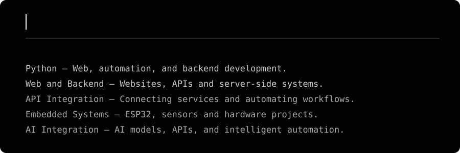

  

<h1></h1> 

  

<h1></h1> 

<picture data-importer="pacman">
  <source media="(prefers-color-scheme: dark)" srcset="https://raw.githubusercontent.com/bhivourdevnath-stack/bhivourdevnath-stack/pacman-output/pacman-contribution-graph-dark.svg?game=pacman">
  <source media="(prefers-color-scheme: light)" srcset="https://raw.githubusercontent.com/bhivourdevnath-stack/bhivourdevnath-stack/pacman-output/pacman-contribution-graph.svg?game=pacman">
  
</picture>

###  Languages

  
  
  
  
  

###  Web & Backend

  
  
  

**Also working with:**  
`REST APIs` • `JSON` • `Jinja2` • `AJAX` • `HTTP`

###  Databases

  
  

**Also working with:**  
`SQL` • `File-based storage` • `Pickle`

###  AI & Automation

  
  

**Currently working with:**  
`LLMs` • `AI APIs` • `Local AI` • `AI Automation` • `Chatbots`

###  Embedded & IoT

  
  

**Also working with:**  
`ESP32` • `Arduino IDE` • `Sensors` • `GPIO` • `I²C` • `IoT`

###  Tools

  
  
  
  
  

###  Deployment & Environment

  
  
  

**Also working with:**  
`uv` • `Virtual Environments` • `Environment Variables` • `.env`

---

###  Currently Exploring

  

`Full-Stack Development` • `AI Automation` • `Local LLMs` • `IoT` • `Backend Systems`

<h1></h1>
 

<h2 data-importer="text" align="left">Stats :</h2>

###

  <table>
  <tr>
  <th></th>
 <th></th>
  </tr>
  <tr>
  <th colspan="2"></th>
  </tr>
  </table>

###

<h2 data-importer="text" align="left">Social media</h2>

###

  
  
  

###
